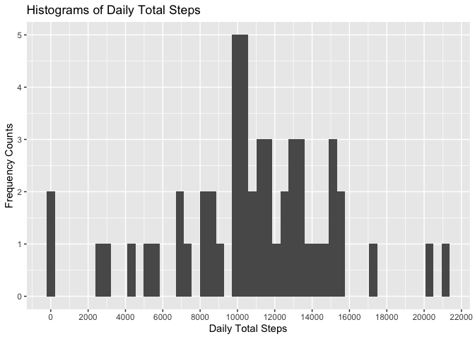
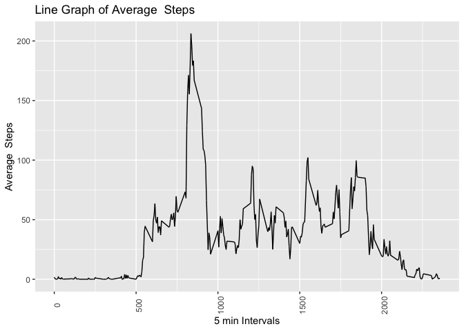
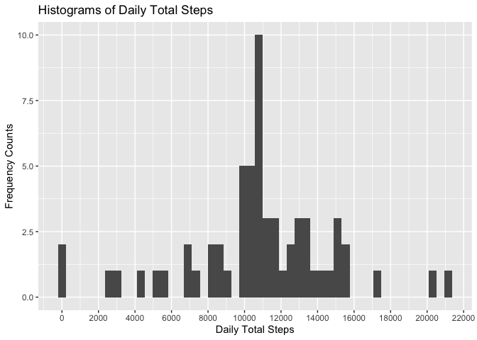
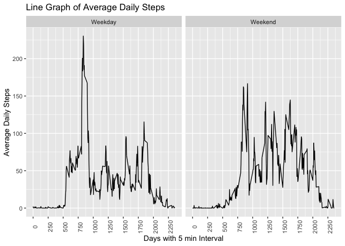

## Loading and preprocessing the data


```r
library(data.table)
df = fread(file = "activity.csv")
str(df)
```

```
## Classes 'data.table' and 'data.frame':	17568 obs. of  3 variables:
##  $ steps   : int  NA NA NA NA NA NA NA NA NA NA ...
##  $ date    : IDate, format: "2012-10-01" "2012-10-01" ...
##  $ interval: int  0 5 10 15 20 25 30 35 40 45 ...
##  - attr(*, ".internal.selfref")=<externalptr>
```

```r
class(df)
```

```
## [1] "data.table" "data.frame"
```

The variables included in this dataset are:

**steps:** Number of steps taking in a 5-minute interval (missing values are coded as NA)
**date:** The date on which the measurement was taken in YYYY-MM-DD format
**interval:** Identifier for the 5-minute interval in which measurement was taken
The dataset is stored in a comma-separated-value (CSV) file and there are a total of 17,568 observations in this dataset.

## What is mean total number of steps taken per day?

1. Calculate the total number of steps taken per day


```r
library(dplyr, warn.conflicts = F)
df_steps <-
    df %>%
    group_by(date) %>%
    summarise(total_steps = sum(steps))

head(df_steps, n = 5)
```

```
## # A tibble: 5 × 2
##   date       total_steps
##   <date>           <int>
## 1 2012-10-01          NA
## 2 2012-10-02         126
## 3 2012-10-03       11352
## 4 2012-10-04       12116
## 5 2012-10-05       13294
```

2. If you do not understand the difference between a histogram and a barplot, research the difference between them. Make a histogram of the total number of steps taken each day

    * Histograms to represent frequency of numerical data 
    * Bargraph to represent frequency of categorical data 
    

```r
library(ggplot2)
qplot(data = df_steps, x = total_steps,
      geom = "histogram", bins = 50,
      main = "Histograms of Daily Total Steps",
      ylab = "Frequency Counts",
      xlab = "Daily Total Steps") + 
    scale_x_continuous(breaks = round(seq(0, 22000, by = 2000)))
```

<!-- -->
3. Calculate and report the mean and median of the total number of steps taken per day

```r
mean_step <- mean(df_steps$total_steps, na.rm = T)
median_step <- median(df_steps$total_steps, na.rm = T)


print(paste("Mean of Daily Step is", round(mean_step)))
```

```
## [1] "Mean of Daily Step is 10766"
```

```r
print(paste("Median of Daily Step is", round(median_step)))
```

```
## [1] "Median of Daily Step is 10765"
```

## What is the average daily activity pattern?

1. Make a time series plot (i.e. type = "l") of the 5-minute interval (x-axis) and the average number of steps taken, averaged across all days (y-axis)


```r
df2 <-
df %>%
    group_by(interval) %>%
    mutate(avg_steps = mean(steps, na.rm = T)) %>%
    ungroup()

qplot(data = df2, x = interval, y= avg_steps,
      geom = "line",
      main = "Line Graph of Average  Steps",
      ylab = "Average  Steps",
      xlab = "5 min Intervals") +

    theme(axis.text.x = element_text(angle = 90))
```

<!-- -->

2. Which 5-minute interval, on average across all the days in the dataset, contains the maximum number of steps?


```r
max_steps <- 
    df2 %>%
    filter(steps == max(steps, na.rm = T)) %>%
    select(c("date", "interval", "steps"))
max_steps
```

```
## # A tibble: 1 × 3
##   date       interval steps
##   <date>        <int> <int>
## 1 2012-11-27      615   806
```

## Imputing missing values

Note that there are a number of days/intervals where there are missing values (coded as **NA**). The presence of missing days may introduce bias into some calculations or summaries of the data.

1. Calculate and report the total number of missing values in the dataset (i.e. the total number of rows with NAs)


```r
sum(!complete.cases(df2))
```

```
## [1] 2304
```

2. Devise a strategy for filling in all of the missing values in the dataset. The strategy does not need to be sophisticated. For example, you could use the mean/median for that day, or the mean for that 5-minute interval, etc.

Here are the total number of missing values in each variables.


```r
sapply(df2, function(x){sum(is.na(x))})
```

```
##     steps      date  interval avg_steps 
##      2304         0         0         0
```

```r
df %>%
    filter(is.na(steps)) %>%
    group_by(date) %>%
    summarise(count = n())
```

```
## # A tibble: 8 × 2
##   date       count
##   <date>     <int>
## 1 2012-10-01   288
## 2 2012-10-08   288
## 3 2012-11-01   288
## 4 2012-11-04   288
## 5 2012-11-09   288
## 6 2012-11-10   288
## 7 2012-11-14   288
## 8 2012-11-30   288
```

I don't see any clear pattern for which days we have missing data. Thus, I can impute the missing values with mean of all data grouped by intervals.


3. Create a new dataset that is equal to the original dataset but with the missing data filled in.


```r
df3 <-
df %>%
    group_by(interval) %>%
    mutate(steps = if_else(is.na(steps),
                            as.integer(mean(steps, na.rm = T)), 
                            steps )) %>%
    ungroup()
head(df3, n=5)
```

```
## # A tibble: 5 × 3
##   steps date       interval
##   <int> <date>        <int>
## 1     1 2012-10-01        0
## 2     0 2012-10-01        5
## 3     0 2012-10-01       10
## 4     0 2012-10-01       15
## 5     0 2012-10-01       20
```
4. Make a histogram of the total number of steps taken each day and Calculate and report the mean and median total number of steps taken per day. Do these values differ from the estimates from the first part of the assignment? What is the impact of imputing missing data on the estimates of the total daily number of steps?


```r
df3_steps <-
    df3 %>%
    group_by(date) %>%
    summarise(total_steps = sum(steps),
              .groups = "drop")

qplot(data = df3_steps, x = total_steps,
      geom = "histogram", bins = 50,
      main = "Histograms of Daily Total Steps",
      ylab = "Frequency Counts",
      xlab = "Daily Total Steps") + 
    scale_x_continuous(breaks = round(seq(0, 22000, by = 2000)))
```

<!-- -->

```r
mean_steps2 <- round(mean(df3_steps$total_steps), digits = 1)
median_steps2 <-  median(df3_steps$total_steps)
print(paste("Mean total number of daily steps is", mean_steps2))
```

```
## [1] "Mean total number of daily steps is 10749.8"
```

```r
print(paste("Median total number of daily steps is", median_steps2))
```

```
## [1] "Median total number of daily steps is 10641"
```

Current statistics are smaller than the statistics of the previous version of the data. Imputing data lead to higher decrease in median of the total daily steps than the mean.   
    
    * Difference in mean of daily steps is 16.3886792  
    * Difference in median of daily steps is 124

## Are there differences in activity patterns between weekdays and weekends?

    * For this part the `weekdays()` function may be of some help here. Use the dataset with the filled-in missing values for this part.
    * Create a new factor variable in the dataset with two levels – “weekday” and “weekend” indicating whether a given date is a weekday or weekend day.
    * Make a panel plot containing a time series plot (i.e. type = "l") of the 5-minute interval (x-axis) and the average number of steps taken, averaged across all weekday days or weekend days (y-axis). See the README file in the GitHub repository to see an example of what this plot should look like using simulated data.

As we see below, there is a spike in the morning time during the weekdays, on average there are more steps in the weekend.


```r
df3 <- 
df3 %>%
    mutate(daytype = as.factor(if_else(weekdays(date) %in% c("Saturday", "Sunday"),
                      "Weekend", "Weekday"))) %>%
    mutate(time = seq.POSIXt(as.POSIXct("2012-10-01 00:00:00"),
                      by = "5 min", along.with = date)) %>%
    group_by(daytype) %>%
    mutate(avg_steps = mean(steps, na.rm = T)) %>%
    ungroup() %>%
    group_by(daytype, interval) %>%
    mutate(avg_steps2 = mean(steps, na.rm = T)) %>%
    ungroup()

qplot(data = df3, x = interval, y= avg_steps2,
      geom = "line",
      main = "Line Graph of Average Daily Steps",
      ylab = "Average Daily Steps",
      xlab = "Days with 5 min Interval") +
    scale_x_continuous(breaks = seq(0, 3000, 250)) +
    theme(axis.text.x = element_text(angle = 90)) +
    facet_grid(. ~ daytype)
```

<!-- -->


